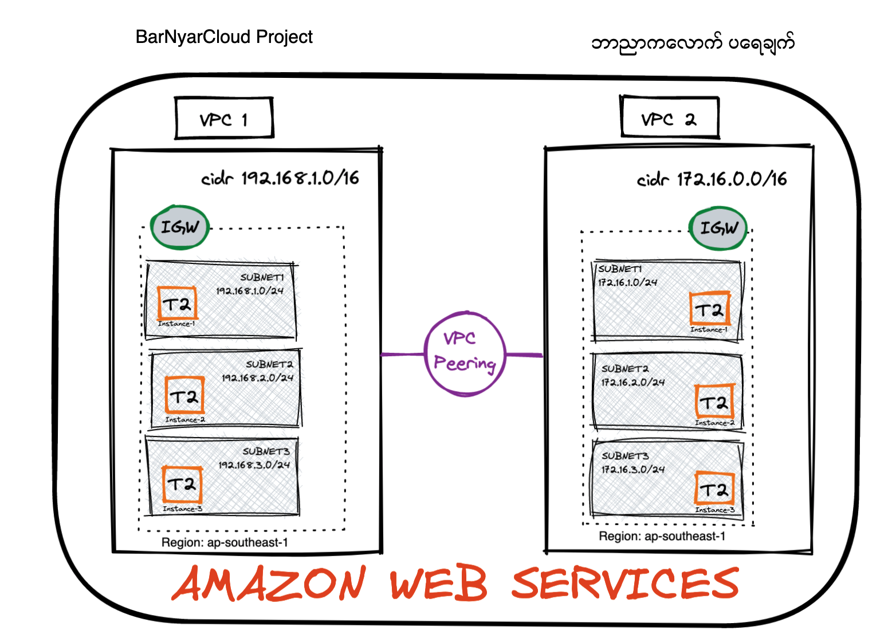
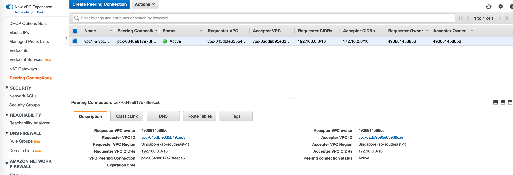
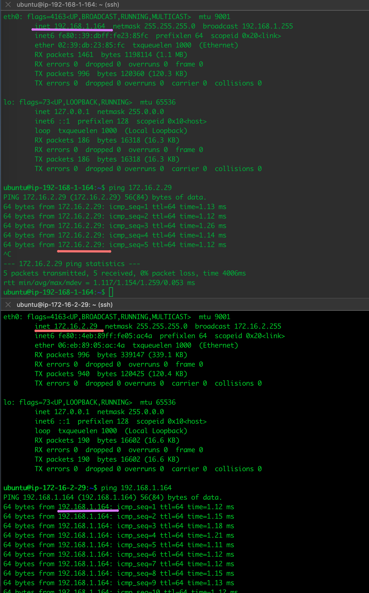
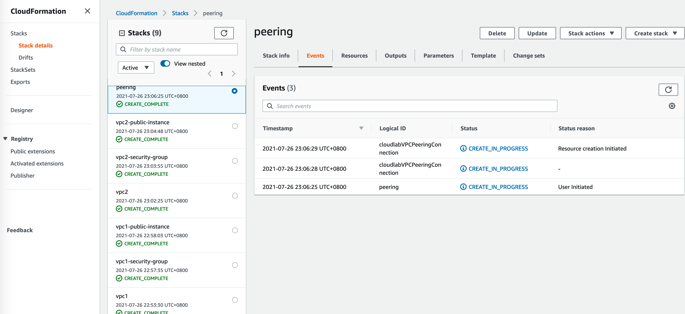

# AWS VPC Peering with AWS CloudFormation Multi-stack

This lab is focusing on AWS CloudFormation (CFN) cross-stack scenarios design and to get familiar with AWS CloudFormation.

There are number of reasons might need to setup VPC peering connection between different VPC within same account or different Account with same region. 



## Prerequisites
1. AWS Account (and key pair)
2. AWS CLI installed on your laptop. [Follow this guide on AWS website.](https://docs.aws.amazon.com/cli/latest/userguide/install-macos.html)
3. [Git](https://git-scm.com/downloads)

## Scenarios 1
1. Create VPC1 with 192.168.0.0/16
2. Create 3 x VPC1 Subnets
3. Create 1 x IGW and add necessary routes
4. Create Security group to permit TCP/22,TCP/443, TCP/80 & ICMP

## Scenarios 2
1. Create VPC1 with 172.16.0.0/16
2. Create 3 x VPC1 Subnets
3. Create 1 x IGW and add necessary routes
4. Create Security group to permit TCP/22,TCP/443, TCP/80 & ICMP

## Scenarios 3
1. Create VPC Peering Connection

Follow the steps to completed the tasks.

## 1. Clone the git repository
```bash
git clone https://github.com/
```
This will clone my git respository to your local directory.

## 2. VPC1 required following AWS CloudFormation templates.
- [vpc1.yaml](./vpc1.yaml)
- [vpc1-security-group] (./vpc1-security-group.yaml)
- [vpc1-instance](./vpc1-instance.yaml)

> Suggect to create a project folder and run the following command in that directory.

### i) Create VPC1 with AWS CloudFormation template "vpc1.yaml".

```bash
aws cloudformation create-stack --stack-name vpc1 --template-body file://vpc1.yaml
```
### ii) Create Security Group with AWS CloudFormation template "vpc1-security-group.yaml".

```bash
aws cloudformation create-stack --stack-name vpc1-security-group --template-body file://vpc1-security-group.yaml
```
### iii) Create Instance with AWS CloudFormation template "vpc1-instance.yaml". The template has prepared 3 instances for different purposed. However, Only one instance enought for VPC Peering and Internet Connection testing.

```bash
aws cloudformation create-stack --stack-name vpc1-instance --template-body file://vpc1-instance.yaml
```

## 3. VPC2 required following AWS CloudFormation templates.
- [vpc2.yaml](./vpc2.yaml)
- [vpc2-security-group] (./vpc2-security-group.yaml)
- [vpc2-instance](./vpc2-instance.yaml)

> Suggect to create a project folder and run the following command in that directory.

### i) Create VPC2 with AWS CloudFormation template "vpc2.yaml".

```bash
aws cloudformation create-stack --stack-name vpc2 --template-body file://vpc2.yaml
```
### ii) Create Security Group with AWS CloudFormation template "vpc2-security-group.yaml".

```bash
aws cloudformation create-stack --stack-name vpc2-security-group --template-body file://vpc2-security-group.yaml
```
### iii) Create Instance with AWS CloudFormation template "vpc2-instance.yaml". The template has prepared 3 instances for different purposed. However, Only one instance enought for VPC Peering and Internet Connection testing.

```bash
aws cloudformation create-stack --stack-name vpc2-instance --template-body file://vpc2-instance.yaml
```

## 4. Validate resources that provisioned such us VPCs, Subnets, Internet Gateway, & Instances. The instances should able to go out internet to install updates, apt update and install is good example to try out `sudo apt-get update && apt-get install`.

## 5. Part of the scenario 3 requirement required to create VPC Peering. Create VPC peering with AWS CloudFormation template "peering.yaml".

```bash
aws cloudformation create-stack --stack-name peering --template-body file://peering.yaml
```


## Congratulation !!! Should able to ping VPC1 instance to VPC2 instance like below the picture.



## Validate the AWS CloudFormation in Console. Should be sucessfully deployed without error.



## 6. Do not forget to destroy your enviroment after testing. Simply executing the following command to destroy all the AWS CloudFormation stacks.

```bash
aws cloudformation delete-stack --stack-name peering                                 
aws cloudformation delete-stack --stack-name vpc2-instance
aws cloudformation delete-stack --stack-name vpc2-security-group 
aws cloudformation delete-stack --stack-name vpc2               
aws cloudformation delete-stack --stack-name vpc1-instance
aws cloudformation delete-stack --stack-name vpc1-security-group
aws cloudformation delete-stack --stack-name vpc1               
```
## 7 Future Reference
[VPC Peering Cost](https://aws.amazon.com/about-aws/whats-new/2021/05/amazon-vpc-announces-pricing-change-for-vpc-peering/) 

I hope you enjoy the lab and thank you so much for your time.